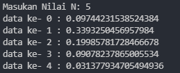
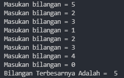

# **Labpy03**


# **latihan1.py**

```sh
import random

n = int(input('Masukan Nilai N: '))

for i in range(n):
    angka = random.uniform(.0, .5)
    print("data ke-", i, ":", angka)
```

1. import random, random merupakan fungsi dari python untuk mengacak nomor.

2. variabel n, berfungsi sebagai inputan nilai N.

3. looping menggunakan for dengan mengacu pada variabel N.

4. variabel angka merandom dari 0.0 sampai 0.5

5. uniform digunakan untuk menampilkan bilangan float random dengan batas awal bilangan x, dan batas akhir bilangan y.

### **Hasil Output**



# **latihan2.py**

```sh
max1 = 0
while True:
    angka = int(input("Masukan bilangan = "))
    if max1 < angka:
        max1 = angka
    if angka == 0:
        break
print("Bilangan Terbesarnya Adalah = ", angka)
```

1. max1 merupakan variabel untuk menentukan angka terbesar.

2. while true, saat if didalam while masih true maka looping tetap berjalan.

3. variabel angka menampung banyaknya bilangan.

4. if max1 < angka berguna untuk menentukan angka terbesar.

5. angka == 0 sebagai proses menghentikan program jika input = 0.


### **Hasil Output**



# **program1.py**

```sh
a = 100000000
for i in range(1, 9):
    if (i >= 1 and i <= 2):
        b = a * 0
        print("Laba bulan ke -", i, " = ", b)
    if (i >= 3 and i <= 4):
        c = a * 0.01
        print("Laba bulan ke -", i, " = ", c)
    if (i >= 5 and i <= 7):
        d = a * 0.05
        print("Laba bulan ke -", i, " = ", d)
    if (i == 8):
        e = a * 0.02
        print("Laba bulan ke -", i, " = ", e)
        total = b + b + c + c + d + d + d + e
        print("\nTotal : ", total)
```

1. masukkan nilai a

2. gunakan for untuk perulangan dari 1 sampai 8.Perulangan for
   disebut counted loop (perulangan yang terhitung)

3. lalu gunakan if pertama untuk menentukan laba bulan ke 1 dan ke 2.masukan variabel (b) kalikan nilai (a) dengan data bulan 1 dan 2. cetak (x) dan (b)

4. lalu gunakan if kedua untuk menentukan laba bulan ke 3 dan ke 4.masukan variabel (b) kalikan nilai (a) dengan data bulan 3 dan 4. cetak (x) dan (c)

5. lalu gunakan if ketiga untuk menentukan laba bulan ke 5 sampai ke 7.masukan variabel (b) kalikan nilai (a) dengan data bulan 5 sampai 7. cetak (x) dan (d)

6. lalu gunakan if keempat untuk menentukan laba bulan ke 8.masukan variabel (b) kalikan nilai (a) dengan data bulan 8. cetak (x) dan (e)

7. lalu total keseluruhan.

8. cetak total

### **Hasil Output**


